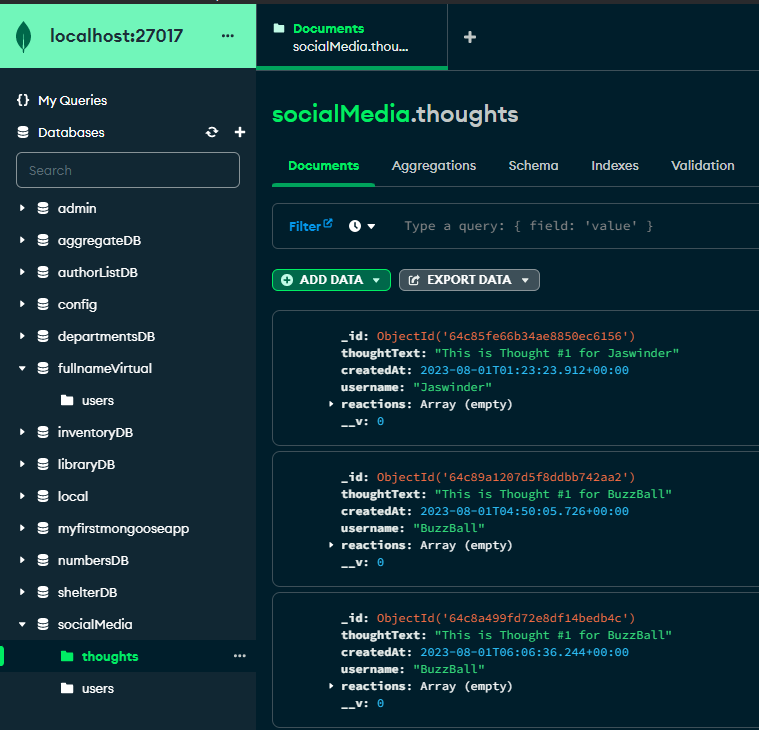

# NoSQL-SocialMediaAPI
  

## Table of Contents
  * [Description](#description)
  * [Installations](#installation)
  * [Usage](#usage)
  * [License](#license)
  * [Questions](#questions)

### Description
This is a social media API where users can share their thoughts, react to friends’ thoughts, and create a friend list.
User can see others thoughts and reactions and have their own custom friends list.

### Installation
Use node server.js to start the application.

### Usage
<pre>
You can use the mongodb to see the social database and the related information. Also can use insomnia to GET, POST, PUT, AND DELETE.
Below are some images for reference:
</pre>

### License
Your application is covered under MIT

### Questions
- Github: https://github.com/jaswindersinghsaini
- Link to video: https://drive.google.com/file/d/1KiKYKsaccaQTWNXEkL3aaF8Qpc4FbotJ/view

